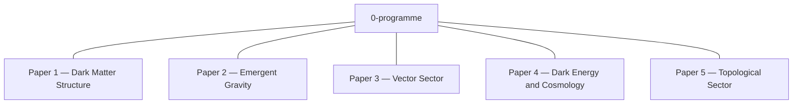

# Programme Theory Map

Scientific dependencies have not yet been reviewed. The diagram records repository coordination only.

```mermaid
flowchart TB
    P0["0-programme"]
    P1["Paper 1 — Dark Matter Structure"]
    P2["Paper 2 — Emergent Gravity"]
    P3["Paper 3 — Vector Sector"]
    P4["Paper 4 — Dark Energy and Cosmology"]
    P5["Paper 5 — Topological Sector"]

    P0 --- P1
    P0 --- P2
    P0 --- P3
    P0 --- P4
    P0 --- P5
```
