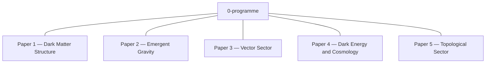

# Programme Theory Map

Scientific dependencies have not yet been reviewed. The diagram records repository coordination only.

## Current physical interpretation — Sea–Ice (PROPOSED)

The Sea–Ice framework is the current physical interpretation of the
lattice-fermion programme. It supplies ontology and vocabulary but **owns
no evidence**: every testable proposition it makes is owned, tested, and
killed by a paper-level gate in a paper repo, bound there by the
CLAIMS↔GATES guard. The framework lives in `sea-ice/`
(`SEA_ICE_PHYSICAL_FRAMEWORK.md`, `SEA_ICE_RESEARCH_MAP.md`,
`SEA_ICE_PREREGISTRATION_POLICY.md`); the programme-gate aliases are listed
in `GLOBAL_GATES.md` and the critical chain in `DEPENDENCIES.md`.

